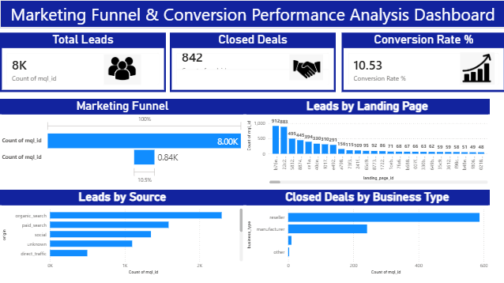

# Marketing Funnel & Conversion Performance Analysis Dashboard

## Project Overview
This project analyzes marketing funnel performance to identify conversion drop-offs, lead source effectiveness, and business conversion trends using Power BI and Python.

The dashboard helps understand:
- Total Leads
- Closed Deals
- Conversion Rate
- Lead Sources
- Landing Page Performance
- Business Type Performance

---

## Tools & Technologies Used
- Power BI
- Python
- Pandas
- Matplotlib
- Excel / CSV Dataset

---

## Project Files

### Dashboard
- Power BI Dashboard (.pbix)

### Dataset
- Marketing Qualified Leads Dataset
- Closed Deals Dataset

### Python Analysis
- marketing_funnel_analysis.py

### Generated Charts
- Funnel Analysis
- Lead Sources Analysis
- Landing Page Analysis
- Business Type Analysis

---

## Key Insights
- Total conversion rate is 10.53%.
- Organic search generated the highest number of leads.
- Significant drop-off exists between leads and closed deals.
- Reseller business type achieved the highest number of closed deals.
- Optimizing low-performing channels can improve conversions.

---

## Dashboard Preview

---

## Skills Gained
- Funnel Analysis
- Conversion Metrics
- Marketing Analytics
- Data Visualization
- Business Insights
- Performance Optimization
